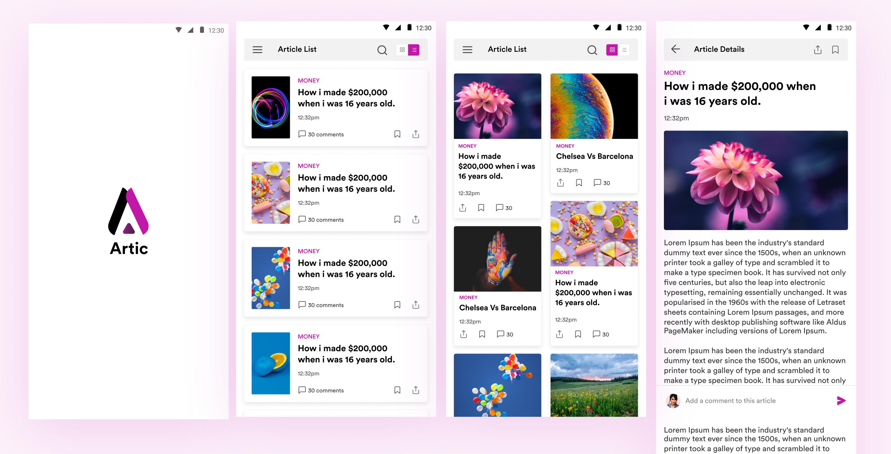
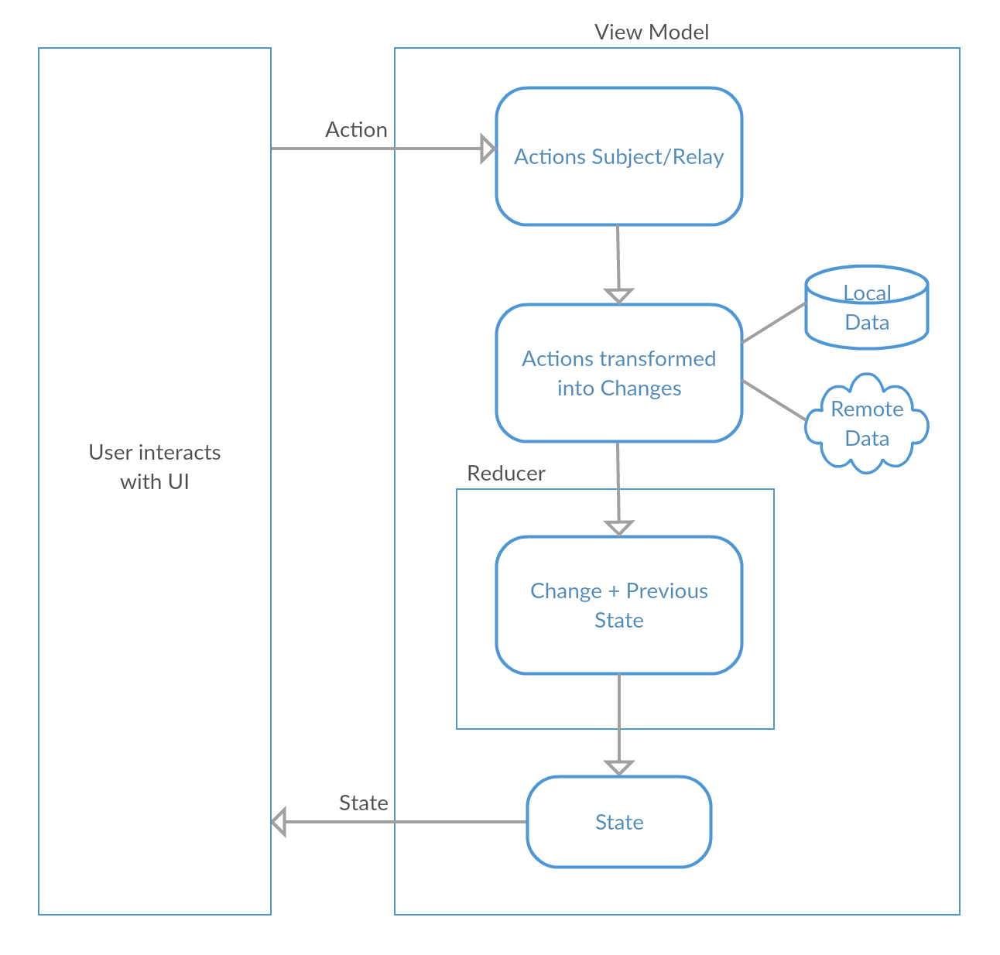
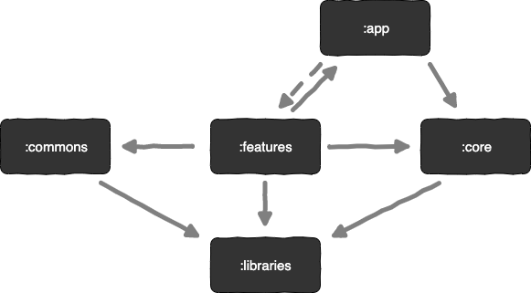

# Artic

Artic is an attempt to build a full featured android app that pulls news articles from a Wordpress blog using dynamic feature modularization, kotlin coroutines and unidirectional data flow.

## UI
The UI was graciously designed by [dikethelmak](https://dribbble.com/shots/6225844-Artic-High-Fidelity-mockup).



## Architecture

The app leverages uni-directional data flow the in building a predictable state machine for every screen. To achieve this, the ViewModel class of the `Android Architecture Components` and Kotlin `Flow` were used. A lot of the architecture decisions were inspired by the talk detailed in [these](https://speakerdeck.com/ragdroid/flowing-things-not-so-strange-in-the-mvi-world) slides.



Source: [Building MVI apps with Roxie](https://proandroiddev.com/unidirectional-data-flow-with-roxie-bec546c18598).

</br>
Another interesting part of the architecture is the use of dynamic feature modularisation to seperate feature related code into the appropriate modules and Dagger 2 for dependency injection in the feature modules.
</br>
</br>



## Libraries
**Dagger2** - Dagger2 was used for dependency injection.</br>
**Kotlin Flow** - Flow was used for threading and data stream management.</br>
**Retrofit2** - Network calls</br>
**AndroidKtx** - For cool extensions to Android classes.</br>
**Architecture Components** - For Lifecycle managment in the presentation layer.</br>
**Mockito** - For mocking test dependencies.</br>
**JUnit** - For Unit test assertions etc.</br>
**Konveyor** - For generating random data for tests.</br>
**Espresso** - For UI testing.</br>

## Todo

I had a lot of fun building this. There are some improvements I intend to make.

- More tests. </br>
- Build settings screen with Jetpack Compose
- Complete article search
- Animations


## Build Instructions
- Clone repository.</br>
- Run with Android Studio 4.0 canary 3 and above. </br>

## License
```
Copyright 2020 Abdul-Mujeeb Aliu

Licensed under the Apache License, Version 2.0 (the "License");
you may not use this file except in compliance with the License.
You may obtain a copy of the License at

   http://www.apache.org/licenses/LICENSE-2.0

Unless required by applicable law or agreed to in writing, software
distributed under the License is distributed on an "AS IS" BASIS,
WITHOUT WARRANTIES OR CONDITIONS OF ANY KIND, either express or implied.
See the License for the specific language governing permissions and
limitations under the License.
```
